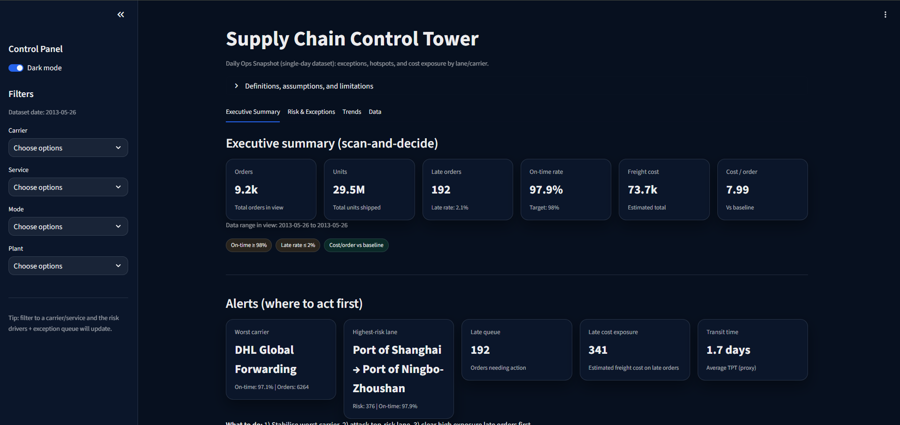
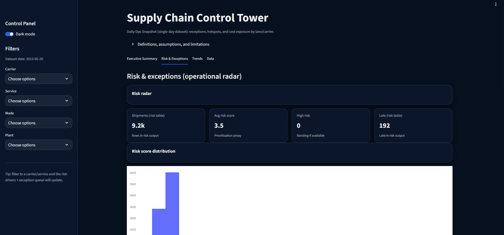
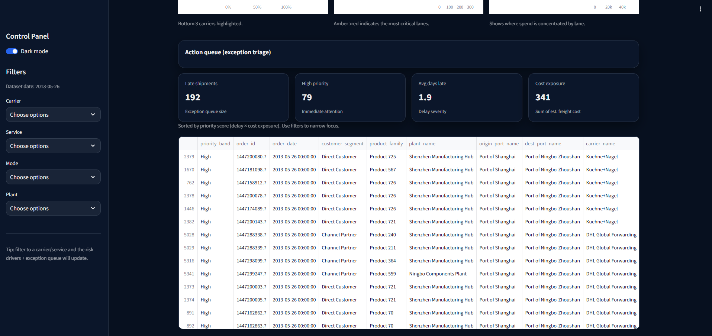
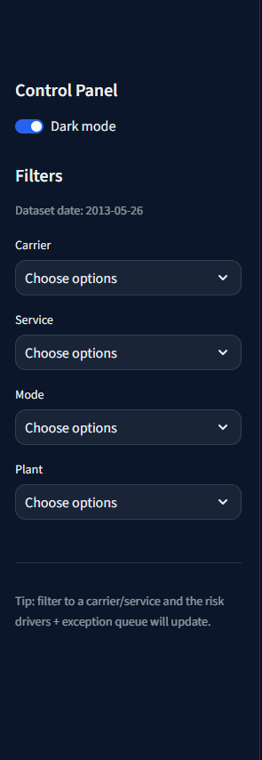

# Supply Chain Control Tower Dashboard

An enterprise-grade Supply Chain Control Tower built with Python, Streamlit, and Plotly.

This project demonstrates how real-world logistics and supply chain organisations monitor operations, manage risk, and prioritise exceptions using a modern analytics control tower.

---

## Overview

The Supply Chain Control Tower provides:

- Executive-level operational visibility  
- Real-time exception monitoring  
- Risk prioritisation and triage  
- Cost exposure analysis  
- Performance driver analysis  
- Operational action queue  
- Enterprise-grade UX design  

The dashboard is designed to feel like a professional command centre used by global logistics, retail, and manufacturing organisations.

---

## Key Features

- Executive KPI cockpit  
- Risk radar and exception management  
- Carrier and lane performance analysis  
- Cost concentration analysis  
- Priority-based action queue  
- Interactive filtering  
- Dark and light mode  
- Context mapping for readable business labels  

---

## Dashboard Screenshots

Screenshots can be added to the `/screenshots` folder.

### Executive Summary — Control Tower Overview


### Risk & Exceptions — Operational Radar


### Performance Drivers — Root Cause Analysis


### Action Queue — Operations Triage


### Control Panel — Interactive Filters


---

## System Architecture

```
Raw Logistics Data
      ↓
Data Preparation Scripts
      ↓
Context Mapping Layer
      ↓
Analytics Tables
      ↓
Control Tower Dashboard
```

### Layers

| Layer | Purpose |
|------|---------|
| Raw Data | Original logistics dataset |
| Processed Data | Cleaned structured tables |
| Context Mapping | Plain-English business labels |
| Analytics Layer | KPI, risk, exception tables |
| Dashboard Layer | Executive control tower UI |

---

## Repository Structure

```
supply-chain-control-tower-dashboard/
│
├── data/
│   ├── raw/
│   ├── processed/
│   └── analytics/
│
├── scripts/
│   ├── 02_prepare_data.py
│   ├── 02b_generate_context_mappings.py
│   ├── 02c_apply_context_mappings.py
│   ├── 03_build_control_tower_v2.py
│
├── streamlit_app/
│   ├── app.py
│   └── requirements.txt
│
├── screenshots/
│   └── *.png
│
└── README.md
```

---

## Installation

```bash
git clone https://github.com/FinnbarrAmbrose/supply-chain-control-tower-dashboard.git
cd supply-chain-control-tower-dashboard
python -m venv .venv
source .venv/bin/activate
pip install -r streamlit_app/requirements.txt
```

---

## Run the Dashboard

```bash
streamlit run streamlit_app/app.py
```

---

## Export & Download Roadmap

Planned enhancements include:

- CSV export of filtered data  
- Excel export of KPI tables  
- PDF export of executive summaries  
- Scheduled reporting packs  
- Automated email distribution  

---

## Predictive Analytics Roadmap

### Phase 2 — Predictive Control Tower

- Late shipment prediction  
- SLA breach forecasting  
- Congestion risk modelling  
- Cost escalation forecasting  
- Carrier reliability scoring  
- Lane failure prediction  

### Phase 3 — Prescriptive Analytics

- Automated recovery recommendations  
- Mode shift optimisation  
- Cost vs service trade-off simulation  
- Digital twin of the supply network  

---

## Why This Project Stands Out

This is not a simple dashboard.

It demonstrates:

- End-to-end analytics architecture  
- Operational KPI design  
- Risk modelling  
- Exception management  
- Enterprise UX design  
- Business storytelling  
- Governance & transparency  
- Production-ready structure  

This reflects how real control towers are built inside global logistics organisations.

---

## Author

 Finnbarr Ambrose  
Supply Chain Analytics & Automation  
